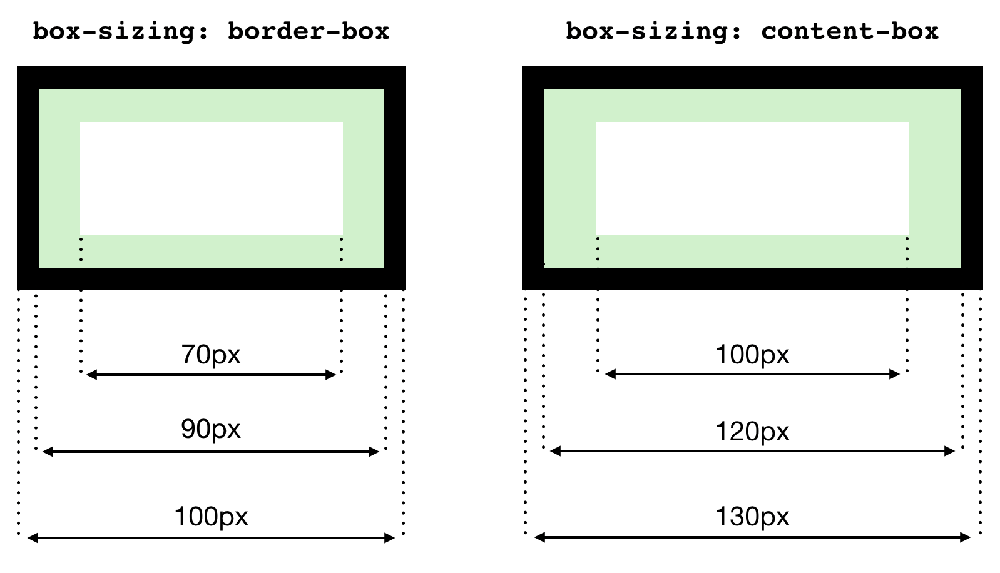

# The `box-sizing` property

Decides whether the `padding` and `border` are part of an elements `height` and `width`.


**Example**

Both boxes below have the following CSS properties:

```css
.box {
  width: 100px;
  border: 5px solid black;
  padding: 10px;
}
```


In addition, each box has the `box-sizing` property set to a different value. The resulting dimensions are as shown:



For `border-box`, the set `width` equals `content width + padding + border`.

For `content-box`, the set `width` is only for the content width. The padding and border dimensions are added to the width of the rendered element.

Default value: `content-box`.

**Note: the same thing applies for the height property as well.**


## `box-sizing` reset method

```css
html {
  box-sizing: border-box;
}
*, *:before, *:after {
  box-sizing: inherit;
}
```

This sets `border-box` eveywhere, but you can use `content-box` in specific places.


Source: https://css-tricks.com/box-sizing/