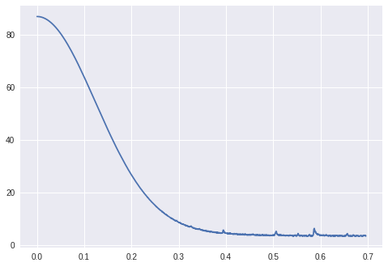

# Cyclical Learning Rates

When trying to use CLR, the LR range test in the original paper was a little confusing for me. Also, I couldn't reproduce the kind of graph the author got after running the LR range test.

I managed to get a graph like the one in fast.ai after a lot of experimentation.

The paramters of the LR range test that worked for me were:

```
clr = CyclicLR(base_lr=0.00001, max_lr=1.5, step_size=5000)

BATCH_SIZE=1024

history_init = tpu_model64.fit(
    X_train, y_train_onehot, batch_size=BATCH_SIZE,
    epochs=50,
    callbacks=[clr]
)
```

Plotting `clr.history['loss']` against `clr.history['lr']` gave me a nice smooth graph to choose the LR from:


