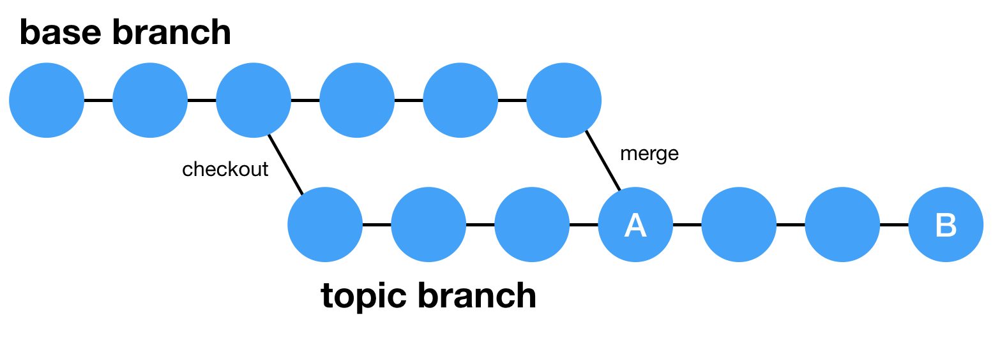
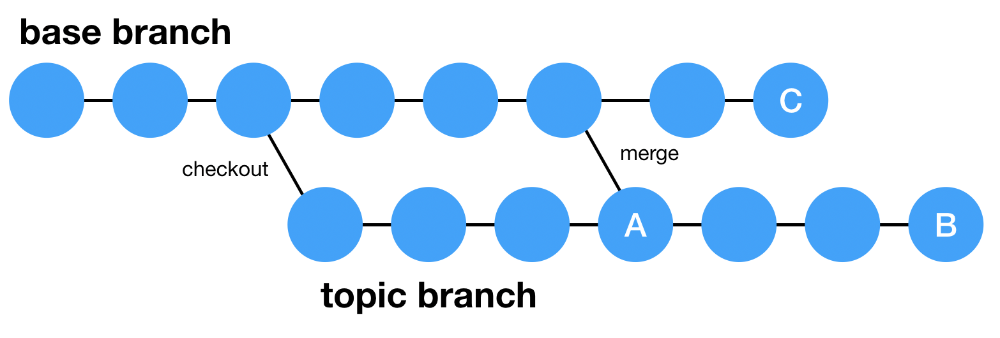

# Diffs in PRs

Topic branch = branch from which you are opening a PR.

Base branch = branch you want to merge changes to.

When a PR is opened on GitHub, the diff shown is a **three-dot diff**. This diff shows the most recent version of the topic branch diff-ed with the commit where the topic branch was last synced with the base branch.

When a PR is opened from the topic branch to the base branch, the diff shown will be between commits A and B.

When a PR is opened from the topic branch to the base branch in this case, the diff shown is between commits A and C (because A is the last commit when the base branch was last synced with the topic branch), and not between commits C and B.

References:

- [GitHub's Pull Request documentation](https://help.github.com/en/articles/about-comparing-branches-in-pull-requests)

